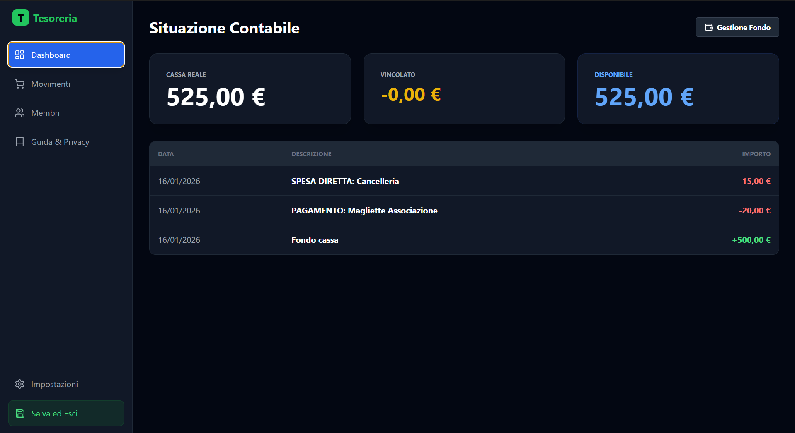
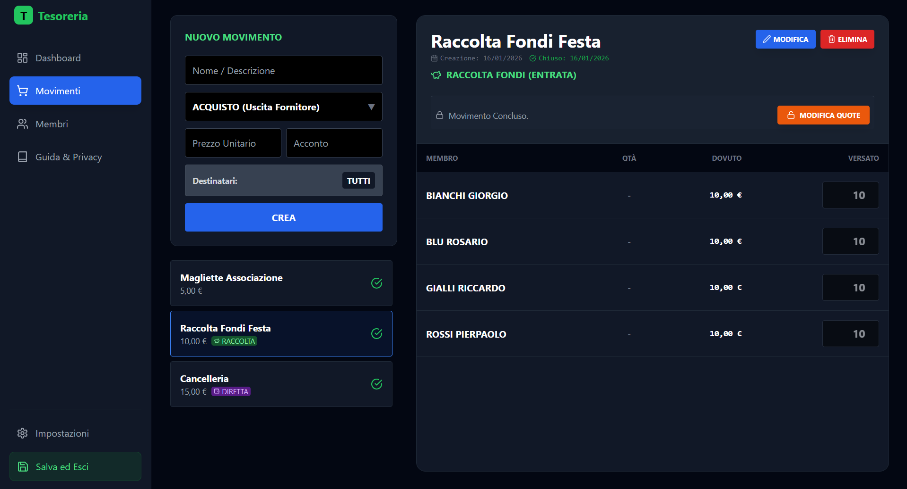
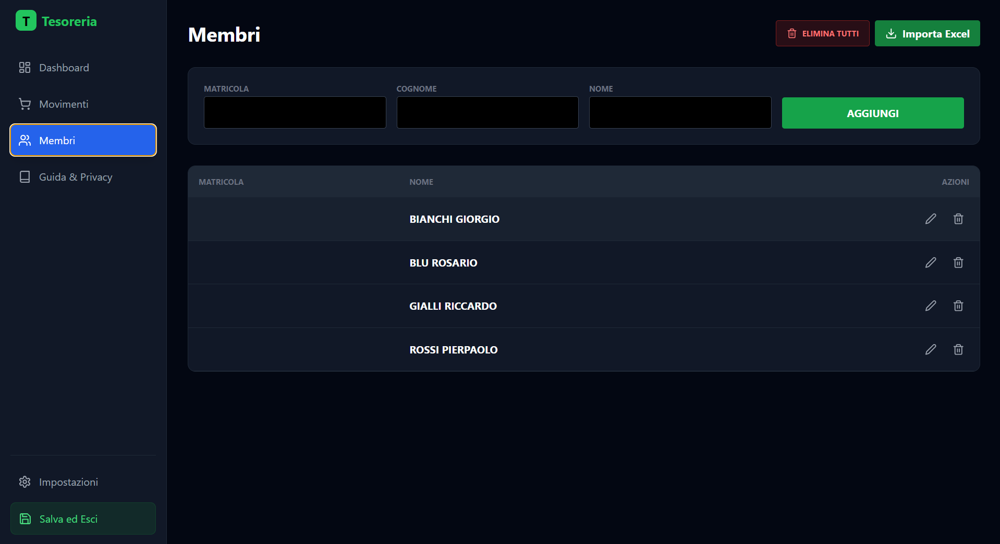
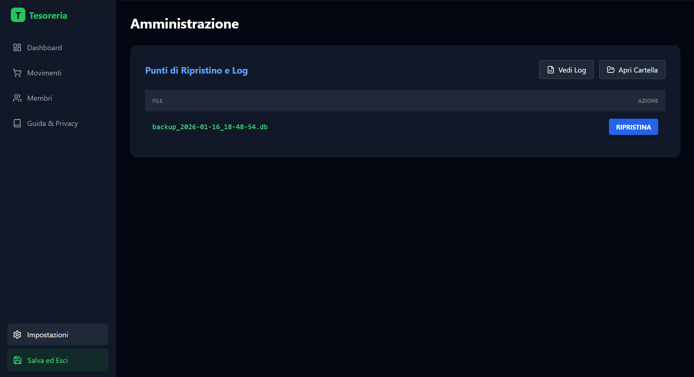

# 💰 Tesoreria - Open Source Accounting Manager

**Tesoreria** è un'applicazione desktop moderna, privata e **Open Source** progettata per la gestione economica di associazioni, gruppi studenteschi, collettivi ed enti no-profit.

Basta fogli Excel che si rompono o calcoli manuali soggetti a errori: Tesoreria offre un registro contabile a partita doppia "invisibile", gestendo automaticamente debiti dei soci, fondo cassa e riconciliazione bancaria.

## 📸 Screenshots

| Dashboard | Gestione Movimenti |
| --- | --- |
|  |  |
| *Panoramica in tempo reale del fondo* | *Creazione spese e ripartizione quote* |

| Gestione Membri | Backup di Emergenza |
| --- | --- |
|  |  |
| *Anagrafica e storico versamenti* | *Recupero dei dati in caso di errori o incompatibilità* |

## ✨ Funzionalità Chiave

### 🔄 Gestione Movimenti Flessibile

Il sistema non si limita alle spese, ma gestisce tre tipologie di flussi finanziari:

1. **Acquisto Standard:** Spese anticipate dal fondo da dividere tra i soci (es. "Merchandising"). Genera automaticamente il debito pro-capite.
2. **Spesa Diretta Fondo:** Uscite secche che non ricadono sui soci (es. "Cancelleria", "Spese Bancarie").
3. **Raccolta Fondi:** Entrate richieste ai soci (es. "Quota Iscrizione", "Donazione").

### 🤖 Automazione e Riconciliazione

* **Importazione Bancaria (Excel/CSV):** Carica l'export della tua banca. Il software analizza le righe e ti permette di assegnare i bonifici ai debiti dei soci con un click.
* **Importazione Membri Massiva:** Carica centinaia di soci in un attimo tramite file Excel.
* **Export Morosi:** Genera un file Excel formattato con la lista di chi non ha ancora versato la quota per un determinato evento.

### 🛡️ Sicurezza e Modifiche

* **Editing Post-Chiusura:** Hai sbagliato un importo su un evento chiuso? Nessun problema. Sblocca il movimento, modifica le quote o i partecipanti e il software ricalcolerà il saldo del fondo retroattivamente.
* **Backup & Ripristino:** Sistema di backup automatico locale. Puoi ripristinare il database a uno stato precedente direttamente dalle impostazioni in caso di errori critici.
* **Privacy 100% Offline:** I dati risiedono in un database SQLite sul tuo disco. Nessun dato viene inviato al cloud.

## 🚀 Flusso di Lavoro

1. **Anagrafica:** Popola la lista membri (manualmente o via Excel).
2. **Nuovo Movimento:**

    * Scegli il tipo (Acquisto/Fondo/Raccolta).
    * Definisci l'importo totale o unitario.
    * Seleziona i destinatari (Tutti i soci o una selezione manuale).

3. **Gestione Quote:**

    * Nella scheda dettaglio, vedi chi ha pagato e chi no.
    * Usa i tasti `+` / `-` per gestire quantità multiple (es. 2 felpe allo stesso socio).

4. **Incasso:**

    * Segna i pagamenti manuali.
    * Oppure usa "Importa Banca" per riconciliare automaticamente.

5. **Chiusura:** Quando l'evento è terminato, chiudilo per "congelare" i conti (riapribile in ogni momento).

## 🛠 Tech Stack

Il progetto è costruito su uno stack moderno, performante e manutenibile:

* **Runtime:** [Electron](https://www.electronjs.org/) (Process separation Main/Renderer).
* **Frontend:** React 18 + TypeScript + Vite.
* **Styling:** TailwindCSS (per una UI pulita e dark-mode native).
* **Icons:** Lucide React.
* **Backend Locale:** Node.js (IPC Bridge).
* **Database:** `better-sqlite3` (SQLite locale ad alte prestazioni, modalità WAL attiva).
* **Parsers:** `xlsx` (SheetJS) per la gestione dei file Excel bancari.

> **Nota tecnica:** Tutti i calcoli monetari vengono eseguiti sanitizzando gli input e gestendo i float con attenzione per evitare errori di arrotondamento finanziario.

## 📦 Installazione e Sviluppo

Vuoi modificare il codice o compilare la tua versione?

### Prerequisiti

* Node.js (v18+)
* npm o yarn

### Setup

1. **Clona il repo:**

```bash
git clone https://github.com/tuo-user/tesoreria.git
cd tesoreria
```

1. **Installa le dipendenze:**

```bash
npm install
```

1. **Avvia in modalità Dev:**

```bash
npm run dev
```

1. **Build (Produzione):**
Genera l'eseguibile (`.exe` / `.dmg` / `.AppImage`) nella cartella `dist` o `release`.

```bash
npm run build
```

## 🤝 Contribuire

Le Pull Request sono benvenute! Per modifiche importanti, apri prima una issue per discutere cosa vorresti cambiare.

1. Fork del progetto
2. Crea il tuo branch (`git checkout -b feature/NuovaFeature`)
3. Committa i cambiamenti (`git commit -m 'Aggiunta nuova feature'`)
4. Pusha il branch (`git push origin feature/NuovaFeature`)
5. Apri una Pull Request

## 📄 Licenza

Distribuito sotto licenza **MIT**. Vedi il file `LICENSE` per maggiori informazioni.

---

*Sviluppato con ❤️ per semplificare la vita associativa.*
